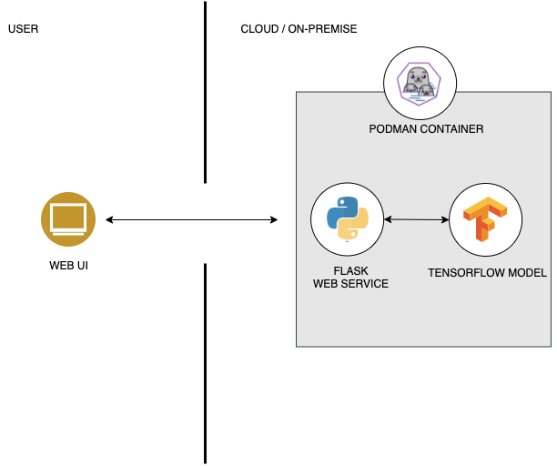

# ic-sample

Image Classifcation Example using ImageNet pretrained ResNet50/Xception model and Flask

## Architecture

## References

* [ImageNet Dataset](https://www.image-net.org)
* [Keras ResNet50](https://www.tensorflow.org/api_docs/python/tf/keras/applications/resnet50/ResNet50)
* [Keras Xception](https://www.tensorflow.org/api_docs/python/tf/keras/applications/xception/Xception)
* [Flask](https://flask.palletsprojects.com)
* [Bootstrap](https://getbootstrap.com)
